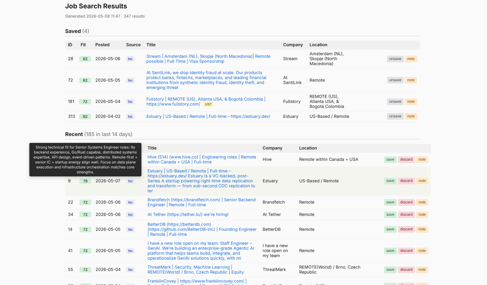

# job-search

Scrape, triage, and LLM-rank remote job postings. Pulls listings from
[JobSpy](https://github.com/Bunsly/JobSpy) (LinkedIn, Indeed, Google, Glassdoor, ZipRecruiter) and
Hacker News "Who is hiring?" threads, stores them in a local SQLite database, scores them against
your CV with Claude, and serves a Flask web UI for browsing and triaging.

 

## Author note

There isn't much hand-rolled Python in this project, use at your own risk. Python purists beware!

There are oddities caused by my personal requirements (e.g. an attempt to rule-out roles that
primarily require Azure familiarity) that might not suit you, but which could easily be tweaked to
your own preferences. There may be other hard-coded assumptions you might want to nudge in a
different direction.

This is designed to run locally against SQLite. While I imagine you could deploy it, I haven't given
any consideration to production use at all.

You'll need to be comfortable with sending your CV to Anthropic (most folks' CVs are public, but
heads-up anyway). Some weight is given to your previous saves and discards also. If you're not
happy sending that much information to the LLM, I don't think it would be too difficult to run the
project against a local Qwen instance or similar.

Cost-wise, it's not too spendy if you're only doing daily runs. The scoring is a one-off (only new
roles are scored, with an attempt to rule out duplicates prior to the scoring pass). This does mean
that if your CV is updated, it won't re-score automatically. There is a fair bit of backfill code
that you might be able to leverage to update existing database rows with new values. I use a
deliberately funds-limited API key, and have spent less than five USD on it during development.

NZ-based folks: it doesn't hit Seek (haven't found a simple way to do that yet).

Everything past this point generated by Claude.

## Quick start

Requires Python 3.11+ and [uv](https://docs.astral.sh/uv/).

```sh
uv sync
cp .env.example .env                  # then fill in API key + CV path
cp config.toml.example config.toml    # then edit search/filter lists
```

Set `UV_ENV_FILE=.env` once in your shell rc so `uv run` auto-loads it:

```sh
echo 'export UV_ENV_FILE=.env' >> ~/.zshrc   # or ~/.bashrc
```

Then:

```sh
uv run python main.py search   # scrape new postings into jobs.db
uv run python main.py score    # ask Claude to rank unscored jobs
uv run python main.py serve    # browse at http://localhost:5000
```

(If you'd rather not set `UV_ENV_FILE` globally, prefix every call with
`uv run --env-file .env ...`.)

## Configuration

Two pieces of personalization, kept out of the repo:

- **`.env`** — secrets and paths. Loaded by `uv run` (see Quick start).
- **`config.toml`** — search queries, region list, exclusion filters, scoring tunables.

Both are gitignored; `.env.example` and `config.toml.example` are committed
templates.

### Environment variables (`.env`)

| Variable                | Required for | Default                | Purpose                                           |
| ----------------------- | ------------ | ---------------------- | ------------------------------------------------- |
| `JOB_SEARCH_API_KEY`    | `score`      | —                      | Anthropic API key used by the scoring command.    |
| `JOB_SEARCH_CV_PATH`    | `score`      | `./cv.md`              | Path to your CV. Plain text, Markdown, or LaTeX.  |

Your CV is sent to the API verbatim; LaTeX is fine — the model reads `\section`,
`\item`, etc. directly. The default path (`cv.md`) and common alternatives
(`cv.txt`, `cv.tex`) are gitignored.

### Project settings (`config.toml`)

Edit `config.toml` to customize what gets searched and filtered. The
`[search]`, `[filters]`, `[scoring]`, and `[ui]` sections in
[`config.toml.example`](config.toml.example) document each option.

## Commands

```sh
uv run python main.py <command> [args...]
```

| Command            | What it does                                                                                        |
| ------------------ | --------------------------------------------------------------------------------------------------- |
| `search`           | Scrape all configured search queries across job boards + HN, dedupe, filter, upsert into `jobs.db`. |
| `hn`               | Scrape just the latest HN "Who is hiring?" thread.                                                  |
| `backfill [N]`     | Re-fetch missing LinkedIn descriptions for existing rows. `N` limits how many to attempt.           |
| `score [N]`        | LLM-rank `new` and `saved` jobs that lack a fit score. `N` limits how many to score.                |
| `serve`            | Start the web UI at `http://localhost:5000`.                                                        |
| `save <id>...`     | Mark jobs as saved.                                                                                 |
| `discard <id>...`  | Mark jobs as discarded.                                                                             |
| `reset <id>...`    | Reset jobs back to `new`.                                                                           |

## Typical workflow

1. **Customize** `[search]` and `[filters]` in `config.toml` — search queries,
   regions, sites, title/company exclusions — to match the roles you want.
2. `search` to populate the database.
3. `backfill` to fetch missing LinkedIn descriptions (LinkedIn often returns
   results without descriptions; this re-visits each posting page).
4. `score` to rank jobs against your CV. The first run uses your existing saves
   and discards as positive/negative examples; later runs benefit from a richer
   pool as you triage more rows.
5. `serve` to browse. Each row gets a colored fit-score badge (green ≥70, amber
   40-69, red <40); hover for the rationale. Use the **save**/**discard**
   buttons to triage; the next `score` run will pick up new rows.
6. Repeat `search` + `score` as new postings appear.

## How scoring works

`score` sends Claude (Haiku 4.5 by default — see `MODEL` in `score.py`) one
request per unscored job. The prompt includes:

- Your CV (read from `JOB_SEARCH_CV_PATH`).
- All `saved` rows that have descriptions, as positive examples.
- The 50 most recent `discarded` rows with descriptions, as negative examples.
- The target posting's title, company, location, and full description.

Claude responds via a forced tool call (`score_fit`) returning an integer
(0-100) and a one-line rationale, both written to the `fit_score` and
`fit_rationale` columns. The CV + examples block is wrapped with
`cache_control` so it's served from prompt cache on every call after the first
— a full 100-job pass typically costs cents.

When scoring a `saved` row (a periodic side-check that the model agrees with
your saves), the row is excluded from its own example set so the model can't
recognize itself.

## Customization

All personalization lives in `config.toml` (see `config.toml.example` for the
schema):

- `[search]` — `queries`, `sites`, `regions`, `results_per_query`,
  `linkedin_fetch_description`.
- `[filters]` — `exclude_title_keywords`, `exclude_companies`. Substrings,
  case-insensitive. Applied at scrape time and retroactively to existing rows.
- `[scoring]` — `model`, `description_truncate`, `max_tokens`,
  `discard_example_limit`, `min_description_length`.
- `[ui]` — `recent_cutoff_days` (the Recent vs Older split in the web UI).

Restart the relevant command after editing — config is loaded once at startup.

## Database

A single SQLite file at `./jobs.db`. Schema is created and migrated
automatically on first connection. Backups are not made — use `cp jobs.db
jobs.db.bak` before destructive experiments.

## Costs

Scraping is free apart from your time and any rate-limit risk on the source
boards. Scoring uses the Anthropic API; with prompt caching, a full pass over
~100 jobs is well under \$1 on Haiku 4.5. The cost scales with the size of
your CV + saved/discarded example pool.

## License

Apache 2.0. See [LICENSE](LICENSE).
